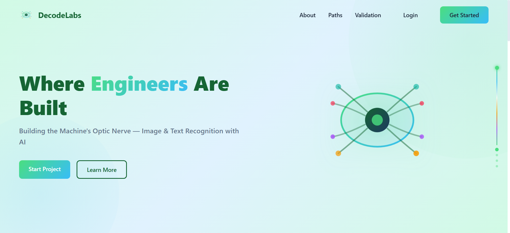
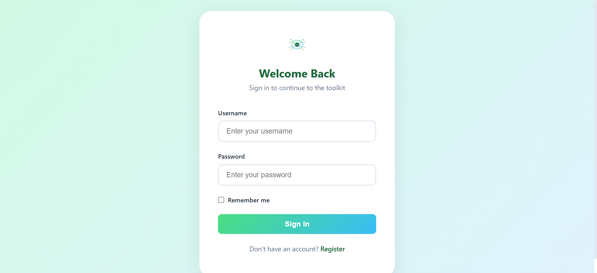
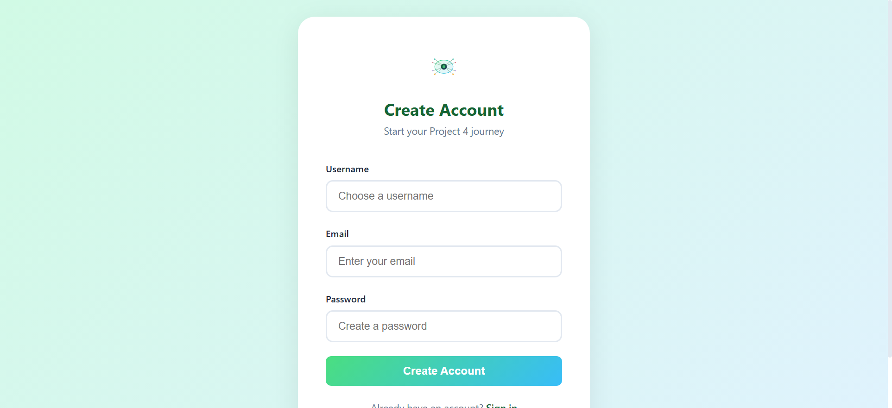
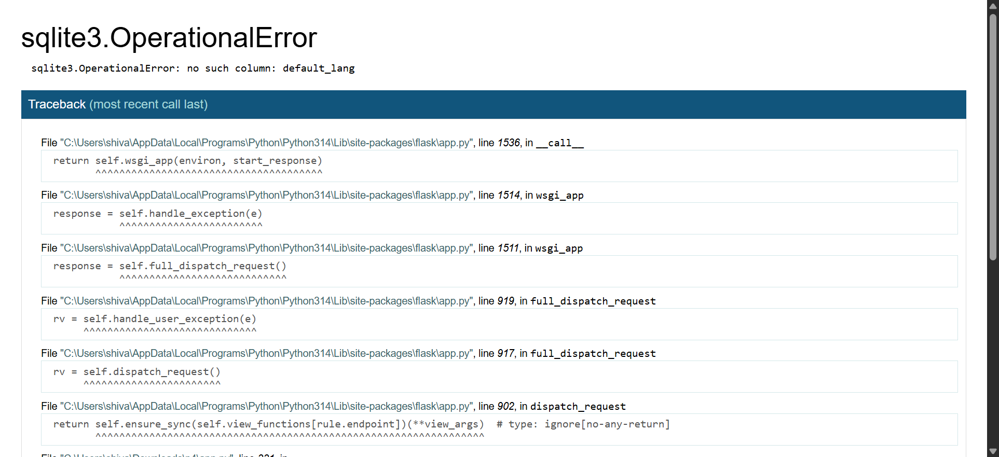
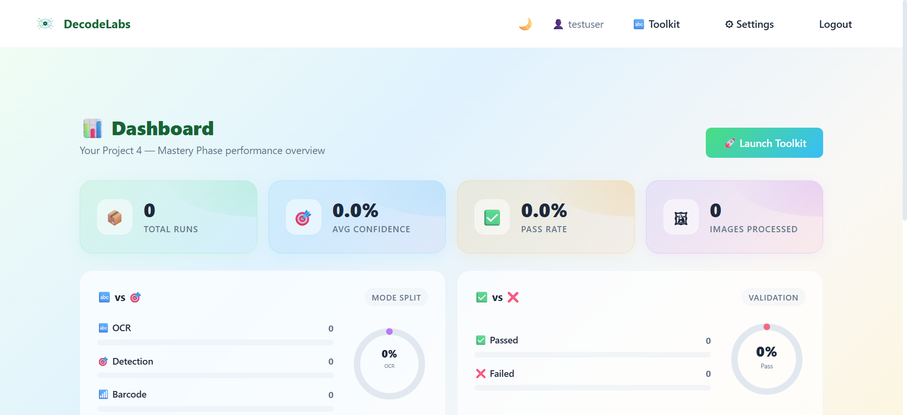
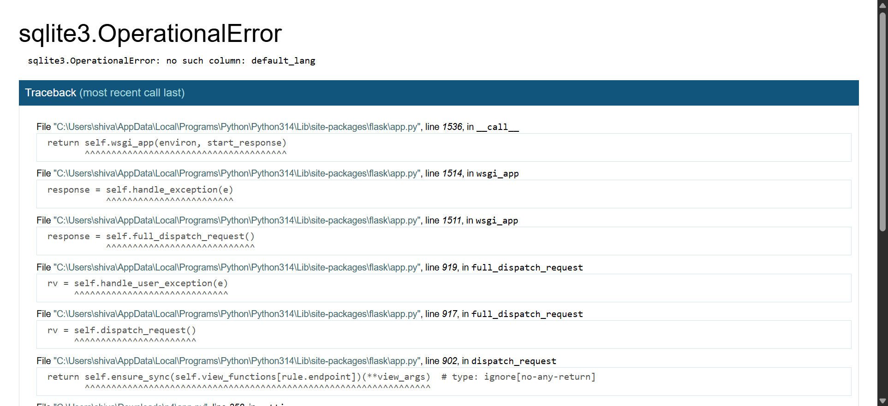

# DecodeLabs — Industrial Training Kit

**Project 4: Optional Mastery Phase** — Building the Machine's Optic Nerve with Image & Text Recognition using AI.

## Overview

DecodeLabs is a Flask-based web toolkit that bridges the gap between structured data and raw vision. It provides three core computer vision capabilities:

- **OCR (Text Recognition)** — Extract text from images using Tesseract with configurable preprocessing (grayscale, blur, deskew, thresholding)
- **Object Detection** — Identify objects in real-time using MobileNet-SSD with OpenCV's DNN module
- **Barcode / QR Detection** — Scan and decode barcodes and QR codes using pyzbar

## Features

- User authentication (register/login/logout)
- Three processing modes: OCR, Object Detection, Barcode/QR
- Image preprocessing pipeline: grayscale, deskew, Gaussian blur, thresholding (Otsu/Adaptive/Binary), rotation, brightness/contrast
- 14 OCR language options
- Webcam capture support
- Batch image upload
- Drag-and-drop & clipboard paste support
- Side-by-side original vs processed image comparison
- Confidence scoring & validation gates (80% threshold)
- Dashboard with statistics, charts, and history
- Exportable results (JSON history, HTML reports, TXT, PNG)
- Customizable default user settings
- Dark/light theme toggle
- Responsive UI design

## Tech Stack

| Component | Technology |
|-----------|-----------|
| Backend | Python, Flask |
| OCR | Tesseract (via pytesseract) |
| Object Detection | OpenCV DNN (MobileNet-SSD) |
| Barcode | pyzbar |
| Image Processing | OpenCV, Pillow, NumPy |
| Frontend | HTML/CSS, Vanilla JS |
| Database | SQLite |

## Installation

```bash
# 1. Clone the repository
git clone <repo-url>
cd p4

# 2. Install dependencies
pip install -r requirements.txt

# 3. Install Tesseract OCR
# Download from: https://github.com/UB-Mannheim/tesseract/wiki

# 4. Download detection model
python download_models.py
```

## Usage

```bash
python app.py
```

Visit `http://127.0.0.1:5000` in your browser.

1. Register a new account
2. Upload an image or use the webcam
3. Choose mode: OCR, Object Detection, or Barcode/QR
4. Adjust preprocessing settings as needed
5. View results with confidence scores and validation status

## Screenshots

| Page | Screenshot |
|------|-----------|
| Homepage |  |
| Login |  |
| Register |  |
| App / Toolkit |  |
| Dashboard |  |
| Settings |  |

## Validation Gates

Each processing pipeline must pass four checks:

1. **Library Integration** — Tesseract/OpenCV correctly installed
2. **Pre-processing Integrity** — Image properly grayscaled, blurred, and deskewed
3. **Accuracy Benchmarking** — Output meets the ≥80% confidence threshold
4. **Visual Confirmation** — Clean output image or extracted text string
